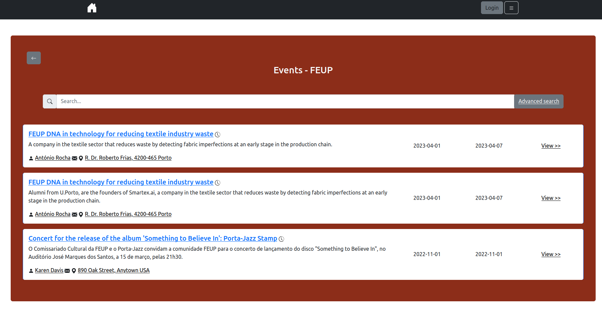

# Páginas Amarelas

> This project, accompanied by UPdigital/U.Porto, aimed to address a significant problem within the U.Porto community: the lack of a centralized platform that displays all the events (such as seminars and workshops) and services offered by or at U.Porto. The motivation behind this project came from the realization that it can be difficult for individuals to be aware of the number of services available at U.Porto, and there is currently no way to know how many seminars or conferences were held last year.

* [Report](docs/report.pdf)
* [Flyer](docs/flyer.pdf)

## Screenshots

## Team

- [Daniela dos Santos Tomás](https://github.com/DanielaTomas)
- [Diogo Filipe Faia Nunes](https://github.com/ICWeiner)
- [Miguel António Borges Tavares](https://github.com/Miggs7)
- [Pedro Miguel da Silva Correia](https://github.com/PedroCorreia56)

